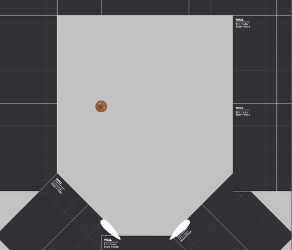
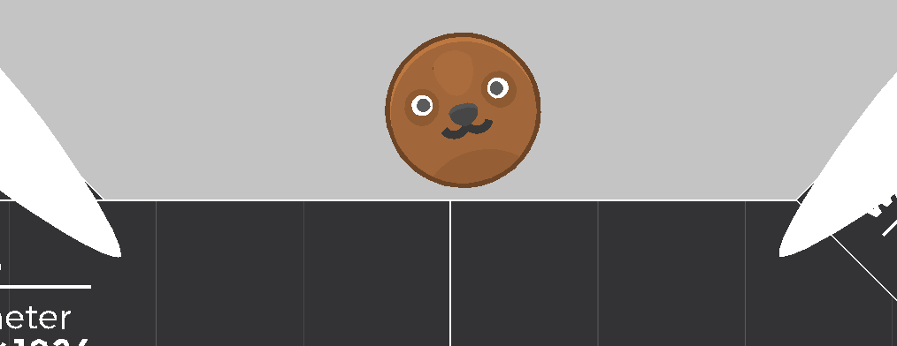
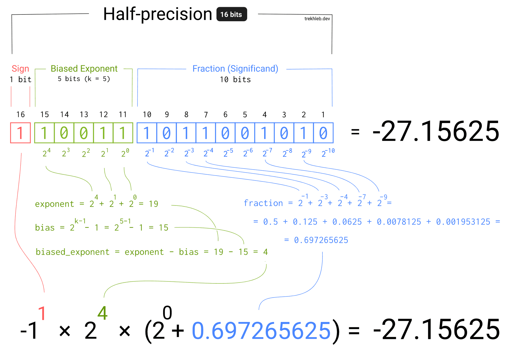

> Don't mind the _**love**ly_ spoiler.

It's been a while, huh? The weekly progress update schedule I aimed to follow is quickly becoming a monthly one... And that's ok, if we keep rowing our game development boat forward. [Row, row row!](https://www.youtube.com/watch?v=_Mvx4X78sqk)

In this entry we will be covering the issue I found during the development of the Godot demo, some alternative physics engines and even how floating number precision works. Fasten your seatbelts, it's going to be a ride.

# The iceberg

If I were to use a metaphor about piloting a boat, I’d be Nami from One Piece, initially clueless about navigating the Grand Line. Except I'm no expert in game development, even less so in physics engines.

But I've indeed stumbled across a couple of issues in the default 2D physics system implemented in Godot we need to unpack. Let me show you a quick gif:


The blindingly obvious issue, that is, once the Ape collides with a specific position, it reaches [Mach 1](https://en.wikipedia.org/wiki/Mach_number) and crosses what was suppose to be the upper limit of the pinball arena, achieving orbit. The funny thing about this bug is that it only happened once, when I was recording to show the current project status to a few friends. I could not reproduce after a few minutes trying. This is the importance of multiple testers, my dear reader.

If you excuse the awful compression of the gif and ignore the unintended VHS effect on the background, you also may be able to see that the flippers - although working at a first glance - moves a little ahead of the ball. That is, it first goes to the end position and, between the physics frames, pushes the ball along its trajectory, making its movement lag behind the actual push.

## The setup

To explain the physics engine within the context of game development, there are typically three main components involved in a physics simulation:

1. **Static Body:** an object that **does not** move at all, used for floors, non-breakable buildings or non-movable objects (in our example, it would be the walls of the pinball)
2. **Dynamic/Rigid Body:** an object that moves and collides with all other objects in the physics world **via the simulation** of forces and momentum (the pinball ball)
3. **Kinematic Body:** an object that does not react to external forces, albeit pushing dynamic bodies around and is moved via some **programming logic** (the flippers)

And how was the ball able to trespass the ceiling of the arena? I have a few ideas, and one of them may be my fault, but baby steps.

How the walls were built is important. Each square block is a different static body, placed each aside another in what was supposed to be a pixel perfect combination of collision polygons, making the trespassing impossible - in theory. But the fact is, I did not build a single polygon, there is non-nullable gap between the walls.

## The... Oops! Accident

Here is my deduction, based on my limited knowledge of how physics simulations work, regarding what caused the ball to clip through the wall:

1. The ball casts a ray on the direction of its velocity to check for any obstacle before its movement...
2. ... but it targets perfectly the void between the walls. So it finds no obstacle and continue moving.
3. Once it moves inside the gap between the walls, its sphere detects collision with the walls and  - as it can't be inside another object - its plunges itself upwards to respect the laws of physics and not let two bodies occupy the same space at the same time.
> A new astronaut ape is launched into the stratosphere.

# To starboard!

I love Godot, but it seems the default behavior for this scenario is inadequate — perhaps an easy fix exists, or it could be a skill issue on my part. Nevertheless, I am not satisfied with the result.

With the release of [Godot 4.4](https://godotengine.org/releases/4.4/), came an alternative physics engine to the custom one implemented by Godot, [Jolt Physics](https://github.com/jrouwe/JoltPhysics), but it is 3D only. That lead to me question, what are other physics engine alternatives, not necessarily for Godot, but for other game engines as well.

* [Unity](https://docs.unity3d.com/Manual/PhysicsSection.html): Uses Nvidia [PhysX](https://github.com/NVIDIA-Omniverse/PhysX) for 3D and [Box2D](https://box2d.org/) for 2D.
* [Game Maker](https://manual.gamemaker.io/monthly/en/GameMaker_Language/GML_Reference/Physics/Physics.htm): Uses Box2D.
* [Defold](https://defold.com/manuals/physics/): Uses [Bullet Physics](https://github.com/bulletphysics/bullet3) for 3D and Box2D for 2D.
* [LÖVE](https://love2d.org/wiki/love.physics): Uses Box2D.
* [Bevy](https://bevyengine.org/): Has no embedded physics engine but two of the most famous are [Avian](https://github.com/Jondolf/avian) and [Rapier plugin](https://github.com/dimforge/bevy_rapier).

I refuse, as a true aquarian (I was born in September 7th), to give in and use Unity, a popular game engine choice, with a lot of assets ready to buy and use, but I don't like things the easy way.

Game Maker is a cool engine, but it is too much GUI-oriented. I'd get irritated to work on a large project with it.

With two options out of the way, we go to the fun part, where I have the opportunity to learn new languages:
* [Rust](https://www.rust-lang.org/): if I were to choose Bevy.
* [Lua](https://www.lua.org/): if I were to choose Defold or LÖVE.

## Bevy

I've started learning Rust intermittently since 2023, and was not able to use it in a meaningful project. But it is a language in my radar to learn for the future. That future could be now if Bevy weren't so new to the game engine market, as it is still in the early development stage and lacks a built-in physics engine, with breaking API changes occurring frequently.

But the language itself is charming, mixing a modern and sometimes functional approach in a low-level environment, competing with C/C++.

```rust
use bevy::prelude::*;

fn main() {
    App::new()
        .add_plugins(DefaultPlugins)
        .add_systems(Startup, setup)
        .run();
}

fn setup(mut commands: Commands, asset_server: Res<AssetServer>) {
    commands.spawn(Camera2d);

    commands.spawn(Sprite::from_image(
        asset_server.load("branding/bevy_bird_dark.png"),
    ));
}
```
> This code only render a sprite onto the screen. But isn't it cute?

## Defold

I stumbled across Defold as an alternative to Godot in a Reddit post, I believe. Its highlights are "free forever", "easy cross-platform" and "production ready". And it uses Lua, with an embedded code editor!

It has a good amount of tutorials and it seems like a capable engine, but... I have to admit it, I could not force myself into learning this new interface and understand how the scene files linked together and what are its base classes. It is not what I'm looking for at the moment. I want to have fun creating solutions via code, and that's where our next - and hopeful - last choice comes in.

## LÖVE

First of all, excelent name, but where does it come from? It seems there is no consensus or definitive story. And second of all, strictly speaking, it is not a game engine, it's a Lua game development framework. But what is the difference?

A game engine provides all the tools for developing a game, usually providing a GUI (graphical user interface) and a set of tools that facilitates the import of assets and the export of the game itself. A framework is just the library that connects the low level operations - like rendering and input handling - to a higher level code (with a Lua script, in our case) or an easier API access. All the other tools and benefits need to be created from scratch.

And I love the challenge of handling everything myself.

### Doesn't that deviate from the "release a game" target?

Yes and no. For the last three years - honestly, I thought it was longer - I've been following the trajectory of [Randy](https://www.youtube.com/@randyprime2/videos) on Youtube, and unfortunally I see myself in that man.

There is a running joke in his community that he is addicted to not making games, as he is constantly distracted by reasons to switch game engines, rewrite code, create an engine from scratch and other valid points that holds him back in his target of _releasing a game_.

And that is precisely what I'm doing right now, while trying to get away with it by putting the reason in a good light.
> Validation is good for the soul, am I right?

But the truth is, I need no validation from others. The most important need is for me to enjoy the process. And learn new languages, frameworks and concepts is important in my game development journey. Heck, some people could even say that I would not need to log this journey in this blog, but this is part of the fun - and a source of motivation to keep moving forward.

# Land ho!

After a week of learning Lua and porting the barebones of what I had to the LÖVE framework, we ended up with a physics simulation that I enjoyed more. Savor the view:



It doesn't have a lot of pre-made classes that Godot has, but I'm excited to work with lua. This baby proof of concept has been made with 207 lines of code! And has a couple of improvements over the last one:

* It has native SVG support via the [TÖVE](https://github.com/poke1024/tove2d) library - thank God it is still maintained! So we can make close up shots and still have a somewhat clean image, as it creates and render the vector graphics as meshes:



And the SVGs can be animated! It will be a nice polish, to be able to animate all the animal marbles into different expressions smoothly. Imagine this little bear guy closing its eyes in pain every time it hits a wall. Delightful! (no animals were hurt int the process of making this game)

* Box2D is the physics engine used in [Angry Birds](https://www.angrybirds.com/), a game renowned by its physics!

## The floating-point arithmetic tangent

This post has been delayed by a couple of days due to a misconception of mine regarding floating-point arithmetic. What was the problem, you ask? Thank you for your interest, let me explain.

If you would like the broader and more complete knowledge on the matter, read the [What Every Computer Scientist Should Know About Floating-Point Arithmetic](https://docs.oracle.com/cd/E19957-01/806-3568/ncg_goldberg.html). It has been linked by almost all posts I found on reddit regarding my problem. Have I read it? No. But I understand the problem and found a solution.

### LÖVE Coordinate System

To understand most of my rambling here, it is important to note that most game systems don't follow the mathematical way of calculating position, with the X-axis increasing from left to right and the Y-axis increasing from bottom to top. Instead, the Y-axis increases its values from top to bottom, as it picture below ilustrates. So, the same reference is to be expected for angles: between the X-axis and Y-axis there is a 90° degree, increasing clock-wise.


### The problem

The right flipper - that's right, only the right one - would not stay still if no key was pressed. See, here is the code for the deactivation of the flipper:

```lua
local function rotateTo(self, finalAngle, shouldStop)
    local currAngle = self.body:getAngle()
    local isReducing = currAngle > finalAngle
    local signal = isReducing and self.angularVelocity < 0 and 1 or -1

    if shouldStop(currAngle, finalAngle) then
        self.body:setAngularVelocity(0)
        self.body:setAngle(finalAngle)
    else
        self.body:setAngularVelocity(self.angularVelocity * signal)
    end
end
```

At this point, `shouldStop` was a simple comparison:

```lua
local function shouldStop(currAngle, finalAngle)
    return currAngle >= finalAngle
end
```


So, if the final angle were to be 225° degrees and the current one starts at 135° degrees, it should increase naturally via the set of the Angular Velocity until it stops at 225°, right?

But that was not happening. It flickered frantically around 225°, never stopping, because of the innacuracy on the comparison, as it didn't have a precise value for the angle. The floating-point representation on memory is as follow:


> Read the blog entry for a better explanation: https://trekhleb.dev/blog/2021/binary-floating-point/

So, the fraction precision is dependent on the size of the number in memory - that is, the number of available bits. Because of this natural deviation, we should compare two floating numbers considering a _delta_. Let's take a second look at `shouldStop`

```lua
local function shouldStop(currAngle, finalAngle)
    return math.abs(currAngle - finalAngle) < 0.01 or currAngle > finalAngle
end
```

That `0.01` is the delta for my comparison, in other words, if two numbers have less than this value of difference, we can consider them equal. And I never had to deal with this because Godot was doing this behind the scenes. The more you know!

> Habemus working pinbal!

## Next Steps

Here is the fun and the hard part. The fun part is to experiment on the possibilities of what can I do as pinball elements. The hard part is not to be distracted too much on improving the current code and creating templates for the next - sure to come - game objects and logic.

Also, I have an excuse to play some pinball games as inspiration. Space cadet, here I come!

---

Thank you for reading! Have a cookie 🍪

See ya next month!
