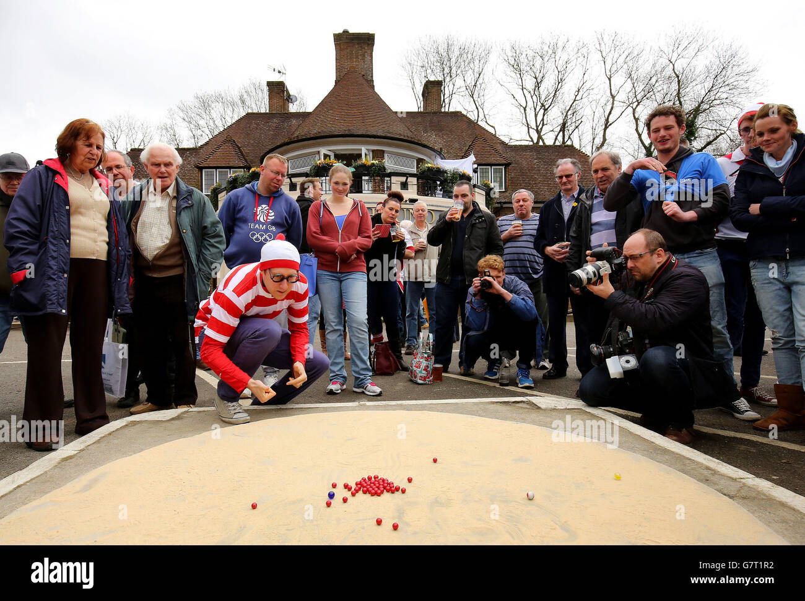
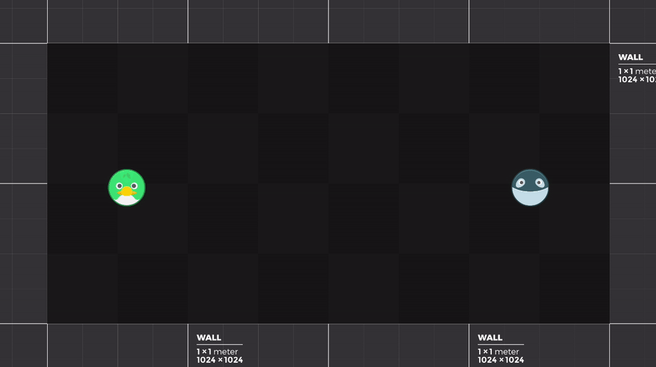
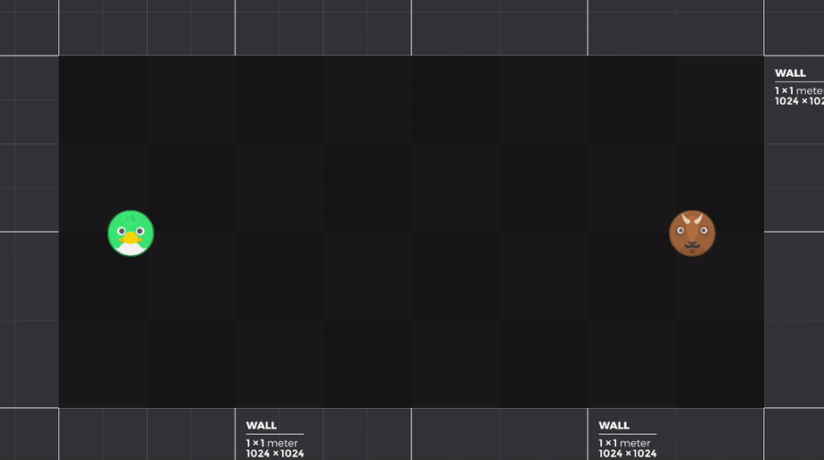
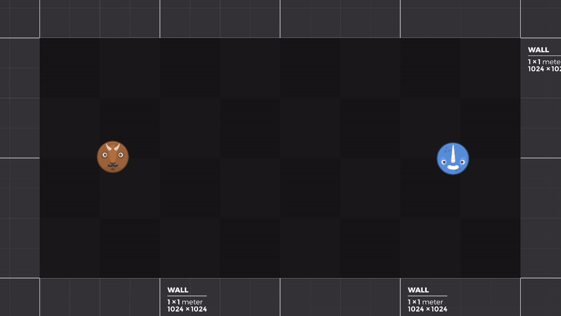

_This week on "What's new with Project Marbles?"_

> I have no idea what I am doing 🐶⚗️

## First, a word from not our sponsors

First of all, I'd like to reserve some words to praise [Obsidian](https://obsidian.md). It is a great platform for note-taking and overall organization, helping with my chaotic way of life to have some structure via its document linking feature. I've been able to create a Game Design document and link every other relevant note to it, allowing for easy navigation within my project. It's a great tool and I encourage everyone to take a look. 

But let's go forward and not allow ourselves be stuck on petty matters, and talk about what's **new**!

## Baby Steps
### No more weird-shaped angled arena

One challenge that was hindering my progress on the dynamic of the battles between marbles was the need for the arena to have a central angled floor, in order to force the competing spheres to collide. But then, speaking with a cherished person of mine about this project, they made me remember one small, important fact: this was a **game**! It would not have to follow real world logic!

So back to [kenney.nl](https://kenney.nl) I went and looked for easy assets to create a simple yet appealing arena. And, as Kenney never disappoints me, I stumbled upon the [Prototype Textures](https://kenney.nl/assets/prototype-textures) pack with beautiful placeholder textures.

After a quick refactor of the first arena, now we had a charming squared sandbox environment to text our marble collisions!

Great! Now... how do we make it interesting? Let's take inspiration from the real thing...

### World Marble Championship

Excuse my ignorance, but I had no idea there was an annual World Marble Championship that has been staged - without skipping a year except for the Covid-19 pandemic - **since 1588**, started during the reign of _Queen Elizabeth I_. That is a crazy old tradition for such a specific sport. And since 1932, it has been held at the [Greyhound Pub](https://greyhoundtinsleygreen.co.uk/) - a great place for Indian food and "the only place in the world who can boast being the host of the world & British Marbles championship".

> Hope you were able to found Wally, this one was challenging.

### Where's Wally tangent

This picture triggered in me a need to understand why in the United States Wally is called Waldo, and there is this information in the [wiki](https://waldo.fandom.com/wiki/Where%27s_Waldo%3F#Production), stating:

> When Handford first designed his leading man, he named him Wally - a shortened formed of Walter or Wallace but commonly used in Britain as a slang term for a somewhat spacey person. However the American publishers of the books felt the name would not resonate with the North American readers; so when the book was finally published there in 1987, the character was renamed Waldo (different name changes worldwide were made in other countries, such as Charlie for France and Walter for Germany, see the table below). 

Among Charlie and Walter, the italian variation is pretty good too: _Ubaldo_, which has a totally different meaning than its british counterpart: it's a germanic name that signifies bold spirit. I mean, they are not exclusive, bold does not mean intelligent or prepared, but who am I to say something.

## Marble's Out

Some attributes for the animal marbles have been added, such as _life points_, _base attack value_ and the main pair of attributes for the entire battle dynamic: _weight_ and _bounciness_. But as you can tell from the above gif, without any movement, there would not be any battle.

That is a problem, but let us test adding a small push to them at the start of the round:

See that first collision of the orca with the duck? It stays still while the duck flies away. That was not the intended behavior I had in mind while creating this attribute. Let us scratch that for now.

And there is another problem: eventually, both of the marbles just stay kicking in place. Another friend of mine suggested adding a force or "wind" that pushes the marbles around, so let's try that:

It fixes the problem of a never ending match, but something is missing. Even though I like watching the marbles bounce, something has to change. I spoke with another friend last week and by accident I disabled the gravity and it behaved as if we were looking from above, like a game of marbles, indeed.

I didn't like that view back then, but now it has grown on me. I believe it has a lot more to offer than the side view of the arena. So let's check that, with the initial push and a central force as well:

It is still very much crude, but I like the path it can go with this approach. There could be various "centers of gravity" and have bumpers, inclining towards a more pinball-like physics. 

## Next Steps, or should I say... Rolls

I must say, this acceptance of the "airplane view" of the arena happened while writing this article, and I'm not sure how I feel about this game heading towards a pinball variant.

I loved playing [Microsoft 3D Pinball](https://alula.github.io/SpaceCadetPinball/) as a kid, as well as the GameBoy Advanced title, [Pokemon Pinball - Ruby & Sapphire](https://en.wikipedia.org/wiki/Pok%C3%A9mon_Pinball:_Ruby_%26_Sapphire).