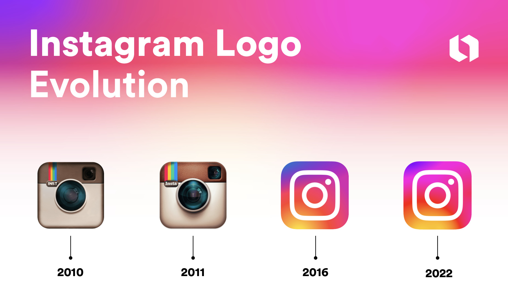

... And more than _three months_ have passed. How have you been? I know in the last entry I said I'd be writing posts monthly, and I promise I tried, but life happens, and sometimes you just can't be at your laptop and in the right state of mind to write about your passions. Or work on them, for that matter.

Anyway, this entry will update you on the current status of the project and explore some of the difficulties I've been facing. And, as always, a bit of random rambling.

# The boat did a one-eighty

We finished the last post more certain about what type of game I wanted: a pinball.
So... hehehe. That has changed. Let's understand the rationale behind it.

From a **technical** standpoint, the current framework (LÖVE) is far more capable of dealing with high-fidelity 2D physics than the last one (Godot), so that was not the problem. The issue I faced was designing interesting **game mechanics** that would encompass what I wanted: a strategic team dynamic with our marbles against an engaging opponent or obstacle.

With that, I did a light exploration of the physics game world to understand the main characteristics I wanted, which are:

* Ball throwing is the main control method for our marbles;
* Different marbles have different enough abilities to considerably change the gameplay style;
* Enemies to be defeated;

What did that remind me of? Angry Birds.

## The Angry Birds tangent

In case you were living under a rock for the past seventeen years, [Angry Birds](https://www.angrybirds.com/explore/hall-of-games/) is a successful franchise that started in the gaming world and is even now launching its third movie, created by _Jaakko Iisalo_ and owned by _Rovio Entertainment Ltd_.

The premise of the first game (back in 2009), which I played the most, is simple: the player has a set of birds, each with its own ability; a slingshot to launch them; and a few green pigs behind destructible blocks to hit, either with the winged projectiles or by smashing them below their own constructions.

Each level presents a new type or combination of birds, along with new types of blocks and various buildings, making it harder for the player to hit all pigs with the limited number of available birds. It is a pretty solid experience for the genre of physics-based puzzles. And, as I said in the previous blog entry, it uses the same physics engine LÖVE uses underneath: Box2D.

## Seasonings of my own

As I don't want to copy a game - be it because of legal issues or lack of creativity - our marbles will work a bit differently:

* The player will have a set of **round animals** - selected from a random pool - to use in a level;
* Every level will have a different layout with a different set of enemies - in the form of **square marbles** - to defeat in order to clear the level;
* With every passing level, there will be a choice to **upgrade** their current set of marbles or **acquire** a new one;
* A **bigger challenge** will await the player each set of levels;
* **Roguelike** elements, like random levels and meta upgrades for each run;

But game design was not the culprit for holding me back these many months. Let's get to the weak spot of our game engine of choice: the **user interface**.

# UI elements from scratch

LÖVE has no built-in UI elements whatsoever. All it provides is the ability to show text, images, and basic shapes in a very simple manner, like "Print a filled blue rectangle with this width and height at x and y position." It also provides the ability to detect mouse position via a couple of methods, so we have all the tools to create a working user interface, right?

Yes, but the system will be built from the ground up. Which can be a good thing, as I've always struggled a bit with the Control nodes in Godot Engine when it comes to resizing. It was _almost_ **never** the way I wanted, with good scaling and maintained proportions.

I want a system to create the UI via simple shapes, provided by the existing drawing functions, to increase future compatibility with mobile and web exports. Inspired by HTML capabilities, padding and margins would be customizable, with rounded borders and even shadow to imitate neumorphism components in the near future. Everything packed in a declarative way to be able to reuse components when needed, lightly inspired by React components.

## In theory, practice is something else entirely

In short, it turns out that it is quite a challenge to create a user interface library from scratch, but I'm liking the process so far. The system is, at this moment, able to show colored boxes in various manners, with primitive tiling capability, splitting its content into pages. I promise it makes sense - check it out:

In the image above, the dark box has a tiling view of - the first page - the red element to the left and a grey element, to the right with a view of - the second page - the pink element. The blue element is the first page of the grey element and the light blue one is in the second page of the dark box.

Their visibility is only on now to validate whether the spacing is being done correctly; they will be cut off from the view of the components with the scissors functions, to crop what is displayed in a portion of the screen.

And that's about it.

> Actually, no, there is another tangent.

# Design styles

I'm by no means a design person. I'm interested in a bit of the theory behind it and some concepts, but I'm far from doing something design-related. Would I like to practice? Sure, and that time will come when I have to create the interface of my upcoming game, so be prepared for the horrors I'll show here in the future.

So, this year Apple launched a new design for their systems, [Liquid Glass](https://www.apple.com/br/newsroom/2025/06/apple-introduces-a-delightful-and-elegant-new-software-design/), and - as the giant it is - should influence the direction overall design heads toward. At first, I thought Liquid Glass was not a great change. The transparency with blur and distortion made the content below weirdly present yet unreadable.

But with each passing day of watching reviews of their presentation, the more it grew on me, and I'll explain why - but we have to go to a bit of the early history of design.

## Skeuomorphism

When smartphones were just crawling out of their cribs, their tech was still alien to the average user: people had phones with small screens and big keyboards, not a single slab of screen. This big screen paved the way for the smartphone to become a Swiss Army knife of tools. But that came with a question for the designers of these systems: how to guide the user to the relevant apps?

Skeuomorphism comes with the idea of using real-world objects to convey virtual functionalities, like having a photorealistic image of a camera for the camera app and a notebook for the virtual phonebook. You may think this is a somewhat new approach, but we can go decades back with the "Save" button being a floppy disk (2010s kids don't have a faint idea what I'm talking about now, sorry) or a "New file" being a blank sheet of paper.

As every trend has its opposing force, to move away from the real objects filled with textures and details, a simpler approach to design was put forward and accepted.

## Flat design

To rest the tired eyes from the information overload every interface had, designers shifted to simple shapes and fewer colors to convey brands and ideas. An example for us to check is the Instagram logo:

> You can check the source of this image and a more comprehensive analysis at https://looka.com/blog/instagram-logo/ 

See that it went from a camera that had reflections in its lenses and even a leather texture at the top half to three basic shapes that conveyed its main elements? To complement the shape, it also chose a set of colors for its branding, and now this logo is impossible to confuse with another platform or not be known.

## Neumorphism

To bring balance back to the design world, a middle ground has been picking up steam. Neumorphism takes the simplicity of the shapes and textures of flat design and reimagines its components as physical objects in the real world, with shadow and smooth textures with light-reflecting properties.

> You can check the source of this image and a lengthier guide to Neumorphism at https://www.justinmind.com/ui-design/neumorphism

That way, the interface remains simple in shapes and colors but with new life in it, reacting to light and being texturized. Changing the "material" of the elements now is a possibility to innovate in this field, just like with liquid glass. And it seems like a trend to be followed, as Microsoft itself adopted similar design objects in their projects. An example is the Microsoft Teams download page, following Apple's approach with objects with glass-like properties:

# Final remarks

Neumorphism is something I'm becoming passionate about, and I intend to follow this design style in this game. It will be a challenge to create something as vibrant as this in a bare-bones framework, but I'm excited about it.

The goal is for the next post to have a functional UI and some basic gameplay elements for us to explore.

---

As always, thank you for reading.

See you in the next post!

